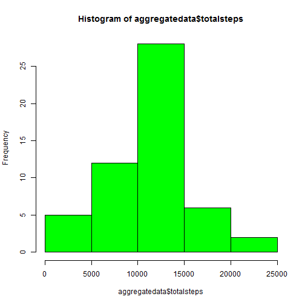
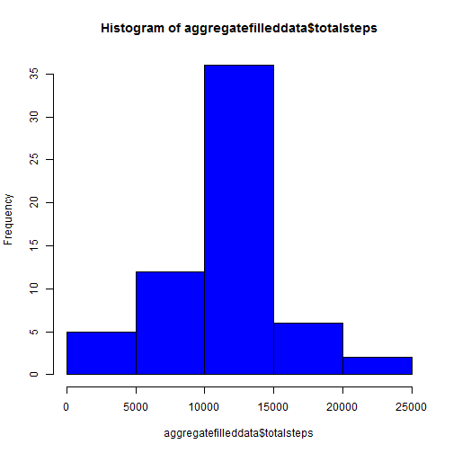
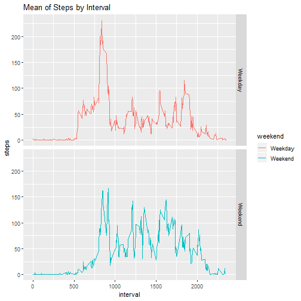

## Loading the data

**Set working directory and read the data file**

```r
setwd("D:\\Training\\Coursera\\Reproducible Research\\Week2")
givendata <- read.csv("activity.csv")
```


## What is mean total number of steps taken per day?

**1. Calculate the total number of steps taken per day**

```r
aggregatedata <- aggregate(givendata$steps, by=list(givendata$date), sum)
# adjust column names
names(aggregatedata)[1] ="date"
names(aggregatedata)[2] ="totalsteps"
```

**2. Make a histogram of the total number of steps taken each day**

```r
hist(aggregatedata$totalsteps, col="green")
```



**3.Calculate and report the mean and median of the total number of steps taken per day**

```r
mean(aggregatedata$totalsteps,na.rm=TRUE)
```

```
## [1] 10766.19
```

```r
median(aggregatedata$totalsteps,na.rm=TRUE)
```

```
## [1] 10765
```


## What is the average daily activity pattern?

**1. Make a time series plot (i.e. type="l") of the 5-minute interval (x-axis) and the average number of steps taken, averaged across all days (y-axis)**

```r
notNA <- complete.cases(givendata)

dataWithoutNA <-givendata[notNA,]

AvgStepsinInterval <- aggregate(dataWithoutNA$steps, by=list(dataWithoutNA$interval), mean)
# set the column names
names(AvgStepsinInterval)[1] ="interval"
names(AvgStepsinInterval)[2] ="steps"
plot(AvgStepsinInterval$interval,AvgStepsinInterval$steps, xlab= "Interval", ylab="Average number of Steps", type="l", pch=20)
```


**2. Which 5-minute interval, on average across all the days in the dataset, contains the maximum number of steps?**

```r
intervalwithMaxSteps <- AvgStepsinInterval[which.max(AvgStepsinInterval$steps),]
intervalwithMaxSteps
```

```
##     interval    steps
## 104      835 206.1698
```


## Inputting missing values

**1. Calculate and report the total number of missing values in the dataset**

```r
numofNARows <- sum(is.na(givendata$steps))
numofNARows
```

```
## [1] 2304
```

**2. Create a new dataset that is equal to the original dataset but with the missing data filled in. Strategy is to replace each missing value with the mean value of its 5-minute interval**

```r
filleddata <- givendata

meanofInterval <- function(steps, interval) {
    valuetofill <- NA
    if (!is.na(steps))
        valuetofill <- c(steps)
    else
        valuetofill <- (AvgStepsinInterval[AvgStepsinInterval$interval==interval, "steps"])
    return(valuetofill)
}

filleddata$steps <- mapply(meanofInterval, filleddata$steps, filleddata$interval)
```

**3. Make a histogram of the total number of steps taken each day and**
Calculate the total number of steps taken per day for the new data(filled NA with means)

```r
aggregatefilleddata <- aggregate(filleddata$steps, by=list(filleddata$date), sum)
# adjust column names
names(aggregatefilleddata)[1] ="date"
names(aggregatefilleddata)[2] ="totalsteps"

hist(aggregatefilleddata$totalsteps, col="blue")
```



**4. Calculate and report the mean and median total number of steps taken per day.**

```r
mean(aggregatefilleddata$totalsteps,na.rm=TRUE)
```

```
## [1] 10766.19
```

```r
median(aggregatefilleddata$totalsteps,na.rm=TRUE)
```

```
## [1] 10766.19
```

**5. Do these values differ from the estimates from the first part of the assignment? What is the impact of imputing missing data on the estimates of the total daily number of steps?**

Mean is the same in both cases. However, the median has increased after NA values were filled with mean values for each intervals


## Are there differences in activity patterns between weekdays and weekends?

**1. Create a new factor variable in the dataset with two levels – “weekday” and “weekend” indicating whether a given date is a weekday or weekend day**

```r
filleddata$weekday <- weekdays(as.Date(filleddata$date))
filleddata$weekend <- ifelse (filleddata$weekday == "Saturday" | filleddata$weekday == "Sunday", "Weekend", "Weekday")
meanfilleddataperdaytype <- aggregate(filleddata$steps, by=list(filleddata$weekend, filleddata$interval), mean)
names(meanfilleddataperdaytype)[1] ="weekend"
names(meanfilleddataperdaytype)[2] ="interval"
names(meanfilleddataperdaytype)[3] ="steps"
```

**2. Make a panel plot containing a time series plot (i.e. \color{red}{\verb|type = "l"|}type="l") of the 5-minute interval (x-axis) and the average number of steps taken, averaged across all weekday days or weekend days (y-axis).**


```r
ggplot(meanfilleddataperdaytype, aes(x = interval, y=steps, color=weekend)) +
  geom_line() +
  facet_grid(weekend ~ .) +
    labs(title = "Mean of Steps by Interval", x = "interval", y = "steps")
```


